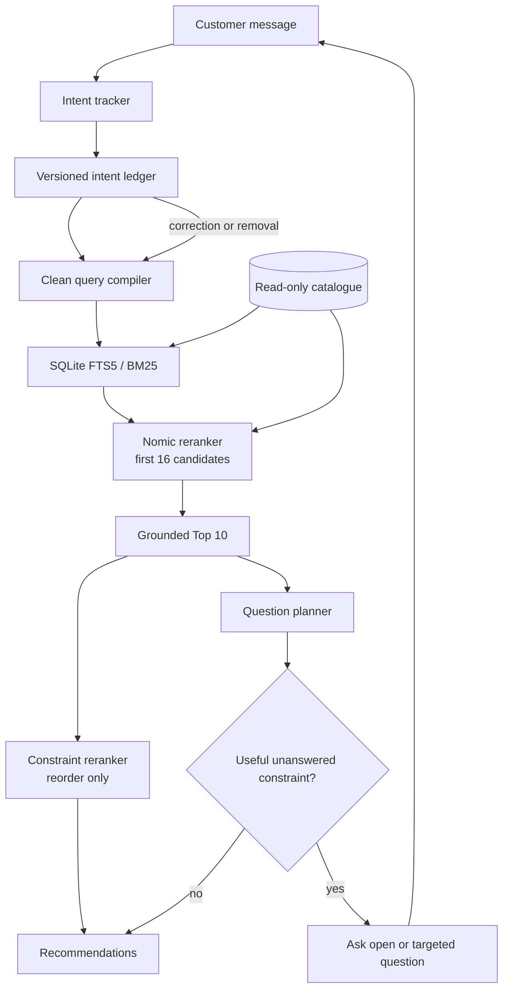

# Threadline: A Local AI Shopping Copilot

Threadline is a local AI-powered, multi-turn shopping agent built for TikTok TechJam 2026 Track 4. It searches the supplied catalogue of 50,000 products, remembers what a shopper has said, asks useful follow-up questions, and adjusts when the shopper changes their mind.

The project uses the open-source `nomic-embed-text` model through Ollama. Runtime search stays local, so there are no API keys, paid credits, or external requests after setup. This makes the system reproducible, cost-free to run, and independent of proprietary AI APIs.

## The problem I wanted to solve

Shopping search rarely happens in one perfect query. A shopper might start with something broad like “I need running shoes”, then gradually add requirements such as a preferred material, budget, or colour. They might also reject an earlier preference or change what they are looking for entirely. A useful assistant needs to search while that conversation is still developing.

Threadline handles four parts of that problem:

- Distinguishing Buying from Browsing intent. Specific requests such as “I need black running shoes under $100” are handled differently from exploratory requests such as “I'm looking for something to wear to the gym.” This allows the system to adapt its search behaviour to how much the shopper already knows about what they want.

- Combining lexical and semantic retrieval. Exact keyword matching is useful for explicit constraints such as brands, colours, and product types, while embedding-based similarity can capture products that are conceptually relevant even when they do not contain the same words as the shopper's query. Threadline combines both signals rather than relying entirely on either approach.

- Asking targeted follow-up questions. Instead of asking a fixed sequence of questions, Threadline looks at the remaining product candidates and asks about attributes that can meaningfully narrow them down. This makes each question useful to the retrieval process rather than simply collecting more information.

- Handling changing preferences across turns. Shopper preferences are not always permanent. If someone first asks for “black running shoes” and later says “actually, I don't care about the colour,” Threadline removes the outdated colour constraint instead of continuing to apply it silently.

Recommendations are returned on every turn. Each message updates the current understanding of the shopper's intent, retrieves the best available products, and then uses the remaining uncertainty to decide what to ask next.

## What makes Threadline different

Threadline is built around a **correction-aware search and decision engine**. Instead of treating the entire conversation as one continuously growing prompt, it maintains a structured **intent ledger** that tracks what the shopper currently wants.

Each preference in the ledger can be **active, replaced, or removed**. When the shopper changes their mind, Threadline rebuilds the next search query using only the preferences that are still active. For example, if a shopper initially asks for *"blue running shoes"* but later says *"actually, not blue anymore,"* the colour preference is removed instead of remaining hidden in the conversation history and influencing later recommendations.

The verified system combines five main components:

- **Field-weighted lexical retrieval.** Threadline uses SQLite FTS5 to search the 50,000-product catalogue, giving different product fields different importance. This provides strong exact-match evidence for explicit requirements such as product types, colours, brands, and materials.

- **Lightweight semantic reranking.** Instead of embedding and comparing the shopper's query against the entire catalogue at runtime, Threadline applies `nomic-embed-text` only to the first **16 candidates** returned by lexical retrieval. This adds semantic understanding while keeping inference small enough to run locally.

- **Structured multi-constraint ranking.** A final ranking pass examines the Top-10 results and promotes products that clearly satisfy multiple active requirements. Importantly, this stage only **reorders existing candidates**; it cannot introduce products that were never retrieved or silently remove products from the candidate set.

- **Open-ended initial questioning.** When the shopper's request is still broad, Threadline begins with an open question rather than immediately guessing which attribute matters most. This lets the shopper introduce requirements that are actually important to them.

- **Candidate-aware follow-up questions.** Once Threadline has more information, it chooses later questions based on the current search results. Candidate questions are evaluated by estimating how much they would narrow the remaining product set and improve the quality of the Top-10 results. The system therefore asks questions because they are expected to improve the search, rather than following a fixed questionnaire.

Recommendations are always grounded in the supplied catalogue: **every recommendation returned by Threadline corresponds to a real product ID from the read-only dataset**.

For debugging and evaluation, an optional decision trace exposes:

- the current intent ledger,
- the retrieval strategy used, and
- why a particular follow-up question was selected.

I also experimented with **full-catalogue dense retrieval** and a **small pairwise ranking model**. These remain documented experiments rather than dependencies of the verified default system. The final pipeline deliberately uses the simpler hybrid approach because it provides semantic retrieval and conversational reasoning while remaining **local, reproducible, and practical to run**.

## Verified public result

These measurements reflect the current **Threadline** system. Compared with the starter baseline, Threadline improves retrieval quality substantially while also reducing the number of turns needed to reach a useful recommendation.

| Metric                     | Starter baseline | Threadline |
| -------------------------- | ---------------: | ---------: |
| TechnicalScore             |         0.106710 | **0.809642** |
| Hit Rate@10                |            0.125 | **0.940** |
| MRR                        |         0.068034 | **0.609472** |
| MTTC                       |             9.81 | **3.16** |
| Reported generative tokens |                — | **0** |

### Performance by scenario

The benchmark contains several different conversational shopping behaviours. Breaking the results down by scenario helps show where Threadline performs well and where the problem remains harder.

| Scenario        | Hit Rate@10 |      MRR |   MTTC |
| --------------- | ----------: | -------: | -----: |
| Boundary        |      0.8000 | 0.549286 |   4.70 |
| Browsing        |      1.0000 | 0.609196 |   2.65 |
| Buying          |      0.9625 | 0.656121 |  2.475 |
| Intent Override |      0.7667 | 0.505873 | 5.8333 |

Threadline performs strongest on **Browsing** and **Buying** scenarios, where the shopper's intent develops without major contradictions. **Intent Override** remains the most difficult case because the system must correctly remove or replace earlier preferences while preserving the rest of the shopper's intent.

The first full run on the development Mac took about **4 minutes 22 seconds** while building a **21 MB embedding cache**. The final warm-cache verification took about **40 seconds**. These timings will vary across hardware.

Because the public benchmark was used during development, repeated tuning against it may lead to some overfitting. These results therefore describe performance on the public set rather than guaranteeing the same performance on the private evaluation set.

### Experiments that shaped the final system

I tested several retrieval, reranking, and questioning strategies before choosing the final Threadline pipeline. The table below shows how individual design changes affected the benchmark. These experiments helped determine which components were worth keeping in the default system.

| Experimental configuration   | TechnicalScore | Hit@10 |      MRR |   MTTC |
| ---------------------------- | -------------: | -----: | -------: | -----: |
| Earlier system               |       0.793614 |  0.925 | 0.602381 |  3.480 |
| Dense promotion every turn   |       0.786133 |  0.925 | 0.575776 | **3.455** |
| Dense promotion on revisions |       0.792364 |  0.925 | 0.597881 |  3.475 |
| Learned gate + open capture  |       0.798071 |  0.940 | 0.568903 | **3.130** |
| Open capture, dense gate off |       0.798992 |  0.940 | 0.573972 |  3.160 |
| **Threadline**               |   **0.809642** | **0.940** | **0.609472** | **3.160** |

The experiments show that adding more learned or dense components did not automatically improve the system. In particular, dense promotion slightly reduced ranking quality despite competitive MTTC. The best overall result came from combining **open requirement capture, hybrid retrieval, correction-aware intent tracking, and the structured Top-10 reranker**.

The full experimental results and rejected configurations are documented in [docs/ollama_ablation.md](docs/ollama_ablation.md).

## Architecture



### How a message moves through Threadline

**1. Customer message → Intent tracker**

The shopper's message is parsed for current preferences, constraints, and corrections to earlier requirements.

**2. Intent tracker → Versioned intent ledger**

The extracted preferences are stored in the ledger as **active, replaced, or removed**. The ledger acts as the source of truth for the shopper's current intent, so only active preferences are allowed to influence future searches.

**3. Intent ledger → Clean query compiler**

Threadline rebuilds the search query using only active ledger entries. If the shopper changes their mind, outdated constraints are excluded instead of remaining in the query and affecting later recommendations.

**4. Clean query → SQLite FTS5 / BM25**

The compiled query is passed to **SQLite FTS5 with BM25**, which searches the full **50,000-product catalogue** for strong lexical matches. This works especially well for explicit attributes such as brands, colours, sizes, materials, and product terms.

**5. BM25 results → Nomic reranker**

The first **16 candidates** are reranked using `nomic-embed-text` based on semantic similarity. This helps Threadline recognise relevant products even when the shopper and catalogue use different wording, without requiring dense retrieval across all 50,000 products.

**6. Nomic reranker → Grounded Top-10**

The highest-ranked candidates form the **grounded Top-10**. Every result is tied to a real product ID from the supplied read-only catalogue, ensuring that Threadline cannot generate products that do not exist.

**7. Grounded Top-10 → Constraint reranker**

The Top-10 products are reordered based on how well they satisfy the shopper's active constraints. This stage can **only reorder existing candidates**; it cannot introduce new products or expand the candidate set.

**8. Grounded Top-10 → Question planner**

At the same time, the Top-10 candidates are passed to the **question planner**. The planner checks whether there is an unanswered constraint that could meaningfully narrow the candidate set or improve the quality of the recommendations.

**9. Recommendation or follow-up question**

If a useful unanswered constraint remains, Threadline asks either an **open-ended or targeted follow-up question**. The shopper's next response then passes through the same pipeline again, updating the intent ledger and triggering a new search.

If no useful question remains, Threadline returns the final ranked recommendations.

### Why this architecture

Threadline deliberately separates **conversation state, retrieval, ranking, and questioning** into different components:

- The **versioned intent ledger** prevents stale or replaced preferences from leaking into future searches.
- **BM25** provides strong exact matching for explicit product attributes.
- **Nomic reranking** adds semantic understanding without requiring expensive full-catalogue dense retrieval.
- The **constraint reranker** improves the ordering of already-grounded products.
- The **question planner** decides what information is actually worth asking the shopper for next.

Full-catalogue dense retrieval and the learned promotion model were explored separately during development. They are documented as experiments for reproducibility, but they are **not part of the final Threadline pipeline**.

More implementation detail is available in [docs/architecture.md](docs/architecture.md).

## Repository structure

```text
starter/
├── agent.py                 conversation flow and orchestration
├── config.py                validated environment settings and defaults
├── session.py               typed per-session state contract
├── intent.py                versioned preference ledger and active intent state
├── dialogue.py              counterfactual question simulation and selection
├── retrieval.py             BM25 retrieval, semantic reranking, and rank fusion
├── structured_reranker.py   exact-constraint Top-10 ordering
├── ollama_embeddings.py     Ollama client and persistent embedding cache
├── dense_index.py           portable NumPy dense index and search utilities
└── promotion.py             experimental pairwise ranking model and feature schema

scripts/
├── build_dense_index.py     resumable full-catalogue index builder
├── download_dense_index.py  release-asset download and verification
├── train_promotion_model.py reproducible public-set ranker training
└── verify_dense_index.py    standalone dense-index compatibility check

evaluator/
└── local_evaluator.py       organizer-provided evaluation harness

tests/                       behaviour, retrieval, model-client, cache, and evaluator tests

docs/
├── architecture.md          architecture decisions and data flow
├── decision_engine.md       intent ledger, question planner, and decision trace
└── ollama_ablation.md       measured experiments, ablations, and design decisions
```

## Setup and installation

Threadline is designed to run **entirely locally** using the organizer-provided catalogue and public evaluation set. The default system does not require paid APIs, external model services, or an external vector database.

### Requirements

You need:

- Python **3.10 or newer**
- NumPy **2.x**
- A Python installation with SQLite **FTS5** support
- [Ollama](https://ollama.com/download)
- The open-source `nomic-embed-text` model
- The organizer-supplied `data/catalog.jsonl`
- The organizer-supplied `data/public_set.jsonl`
- About **274 MB** of disk space for `nomic-embed-text`

An additional **~160 MB** is needed only if you want to reproduce the optional full-catalogue dense retrieval experiment. This experiment is not required to run or evaluate the default Threadline system.

### 1. Install Python dependencies

```bash
python3 -m pip install -r requirements.txt
```

### 2. Install Ollama and download the model

On macOS with Homebrew:

```bash
brew install ollama
brew services start ollama
ollama pull nomic-embed-text
```

On other operating systems, install Ollama using its official instructions, start the Ollama service, and run:

```bash
ollama pull nomic-embed-text
```

Confirm that the model is available:

```bash
ollama list
```

The output should include:

```text
nomic-embed-text
```

### 3. Add the competition data

Threadline uses the **frozen catalogue and public development sessions supplied by the TikTok TechJam 2026 Track 4 participant kit**.

Place them at:

```text
data/catalog.jsonl
data/public_set.jsonl
```

The catalogue is treated as **strictly read-only**. Threadline does not modify catalogue records, create mock product IDs, or inject additional products.

If the catalogue is missing, verify and extract the participant-kit download and follow the instructions in [data/README.md](data/README.md).

---

## Run Threadline

### 1. Start Ollama

If Ollama is not already running:

```bash
ollama serve
```

### 2. Run the automated tests

```bash
python3 -m unittest discover -v
```

Expected result:

```text
Ran 32 tests
OK
```

### 3. Reproduce the public evaluation

Run Threadline using the organizer-provided public evaluator and dataset:

```bash
python3 -m evaluator.local_evaluator \
  --dataset data/public_set.jsonl \
  --catalog data/catalog.jsonl \
  --output results.json \
  --diagnostics-output results.diagnostics.json
```

The default Threadline pipeline does **not** require the optional full-catalogue dense index.

The verified public result is:

| Metric | Threadline |
| --- | ---: |
| TechnicalScore | **0.809642** |
| Hit Rate@10 | **0.940** |
| MRR | **0.609472** |
| MTTC | **3.16** |
| Reported generative tokens | **0** |

These results are measured only on the **200 organizer-provided public development sessions**. Threadline has no access to the **800 private evaluation sessions**, so public-set performance should not be interpreted as a guarantee of private-set performance.

### Diagnostic output

The evaluator also produces `results.diagnostics.json` for error analysis.

For failed sessions, the report identifies whether the target product was:

- absent from the BM25 candidate set,
- pushed below the Top-10 during Nomic reranking,
- left below the final ranking cutoff,
- shown before an intent override, or
- affected by a question that could not reveal a remaining constraint.

These diagnostics are collected without passing the target product ID into the agent, so evaluation information cannot influence the recommendations themselves.

---

## Optional experiments

The following experiments were tested during development but are **not part of the final Threadline pipeline**.

### Full-catalogue dense retrieval

Threadline also includes an **experimental full-catalogue dense retrieval path** that was tested during development against the default hybrid pipeline. It is **not part of the final Threadline system** and is retained only so the experiment can be reproduced.

The implementation uses a local NumPy index and does not depend on an external vector database or hosted retrieval service.

To download and verify the prebuilt experimental index:

```bash
python3 -m scripts.download_dense_index --url <release-asset-url>
python3 -m scripts.verify_dense_index
```

To rebuild it locally instead:

```bash
python3 -m scripts.build_dense_index
python3 -m scripts.verify_dense_index
```

The builder is resumable and reuses embeddings from its local SQLite cache if interrupted.

Measured build time on the development machine was approximately:

- **53 minutes** from an empty cache
- **44 minutes** with the existing embedding cache

Index construction is offline preparation work and is **never performed by the evaluator**.

### Learned promotion model

A small learned promotion model was also tested as an alternative ranking strategy during development. It is not used by the final Threadline pipeline.

To reproduce this experiment:

```bash
python3 -m scripts.train_promotion_model
THREADLINE_DENSE_MODE=learned python3 -m evaluator.local_evaluator
```

Neither the full-catalogue dense retrieval experiment nor the learned promotion model is required to reproduce Threadline's verified public result.

---

## Generated files

Threadline may generate the following local artifacts:

```text
.threadline_cache/product_embeddings.sqlite3
.threadline_cache/dense_index.npz
results.json
results.diagnostics.json
```

Generated caches, Ollama model files, evaluation outputs, and competition data are intentionally excluded from Git.

The small experimental promotion-model weights are committed as readable JSON so that the experiment can be reproduced.

## Model and credential requirements

Threadline requires **Ollama** and **`nomic-embed-text`** for its default semantic reranking stage. There is no non-model fallback.

If either dependency is unavailable, startup fails with a clear setup message rather than silently switching to a different retrieval strategy.

Threadline requires **no API keys, paid model credits, or external runtime requests**, and no credentials or secrets are stored in the repository.

## Configuration

The reported Threadline result uses the verified default configuration:

```text
THREADLINE_DENSE_MODE=off
THREADLINE_CORRECTION_SEMANTIC=clean
THREADLINE_QUESTION_POLICY=guarded
## Testing

The 32 tests cover:

- Session isolation and non-repeating recommendations
- Configuration defaults, overrides, and validation
- Buying and Browsing routing
- Follow-up preference updates
- Intent correction and stale-preference removal
- Selective slot replacement and attribute removal
- Versioned ledger state and public decision traces
- Counterfactual question-value metrics
- Clean-intent semantic reranking after corrections
- Recommendations returned while asking a question
- Budget and exclusion tracking
- Required-model error messages
- Embedding normalization and cache round trips
- Dense-index round trips, semantic search, and catalogue mismatch rejection
- Pairwise-ranker training and portable model round trips
- Structured-reranker promotion, weak-evidence stability, and exclusion safety
- Verified-default startup without a full dense index
- Evaluator response normalization and scoring
- Per-stage failure-diagnostic classification

Tests use a small deterministic embedder so unit tests stay quick. The reported public score was produced with the real Ollama model.

## Limitations and reflection

**Candidate recall versus ranking precision.**  
Full-catalogue dense retrieval can recover products that BM25 misses, but promoting dense candidates too aggressively reduced ranking quality in my experiments. The final Threadline pipeline therefore keeps dense promotion outside the default system and prioritizes the more stable hybrid ranking approach.

Given more time, I would evaluate promotion thresholds on a separate validation split and introduce confidence-based promotion, so semantic candidates are only admitted when the expected recall gain is likely to outweigh the risk of lowering MRR.

**Intent Override robustness.**  
The versioned intent ledger correctly removes stale preferences and rebuilds the query after a shopper changes their mind. However, an abrupt correction can still leave the desired product outside the initial BM25 candidate set.

Given more time, I would add a correction-specific candidate expansion step and measure whether the improvement in recall justifies the additional embedding computation and per-turn latency.

---

## External service and model disclosure

Threadline uses **Ollama** as a required local model service running on `localhost`.

After Ollama and `nomic-embed-text` have been downloaded, Threadline requires:

- no internet connection,
- no API keys,
- no paid model credits, and
- no external runtime services.

The model weights are not stored in this repository.

`nomic-embed-text` is distributed under the **Apache License 2.0**. See the [Ollama model page](https://ollama.com/library/nomic-embed-text) for model details.

---

## Team contribution

This is a **solo submission** by **Er Teng Sheng Elgin**. All system design, implementation, experimentation, testing, evaluation, and documentation were completed independently.

---

## Data attribution

The product catalogue and evaluation sessions are derived from **Amazon Reviews 2023** by the McAuley Lab at UCSD.

See [DATA_ATTRIBUTION.md](DATA_ATTRIBUTION.md) for full attribution and dataset details.

The Track 4 starter kit, competition catalogue, evaluation sessions, evaluator, and problem specification were provided by **TikTok TechJam 2026**.
